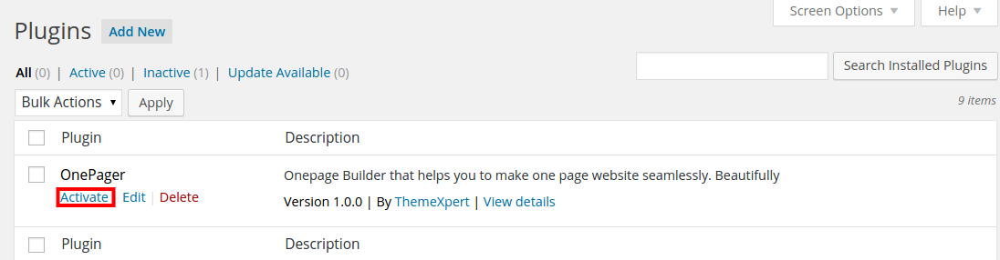

One page site builder, OnePager runs outstandingly fabulous without being dependent on any theme or template.   Every OnePager-enabled theme has to depend OnePager to enable all available innumerable functionality, that build you a wonderful one page website in couple of minutes. Whereas OnePager-powered themes  and templates don’t need any other dependency and even OnePager plugin itself. 

## Downloading OnePager
OnePager doesn’t require any third party component, library, and plugins to download.  It’s prepackaged with all dependency integrated at core. Just downlaod the OnePager builder plugin from the flowing links, and install. 

##Installing the OnePager

To install the OnePager in WordPress CMS, login to WordPress dashboard. Head over to **Plugins > Add New > Upload** and follow the prompts to upload the OnePager plugin zip and activate it. 

When you’ve done with the OnePager installation, An option of OnePager settings will be added in settings panel. 
