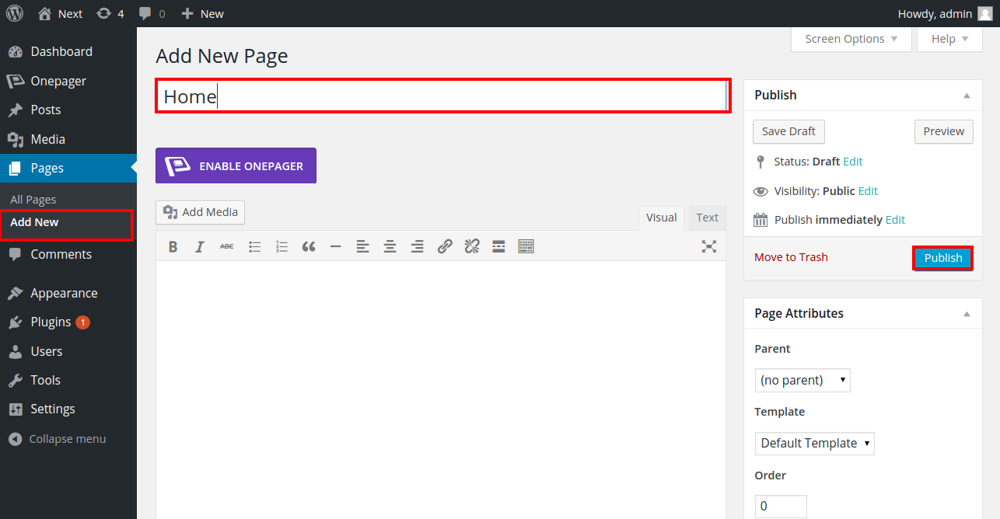
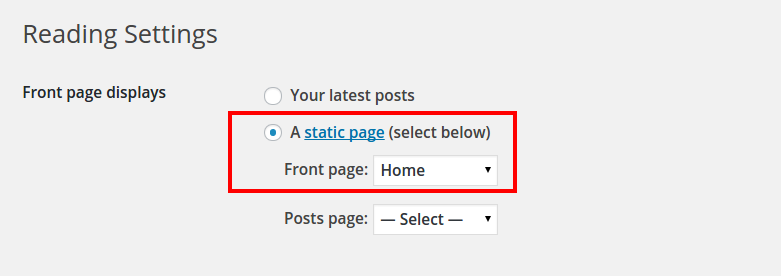
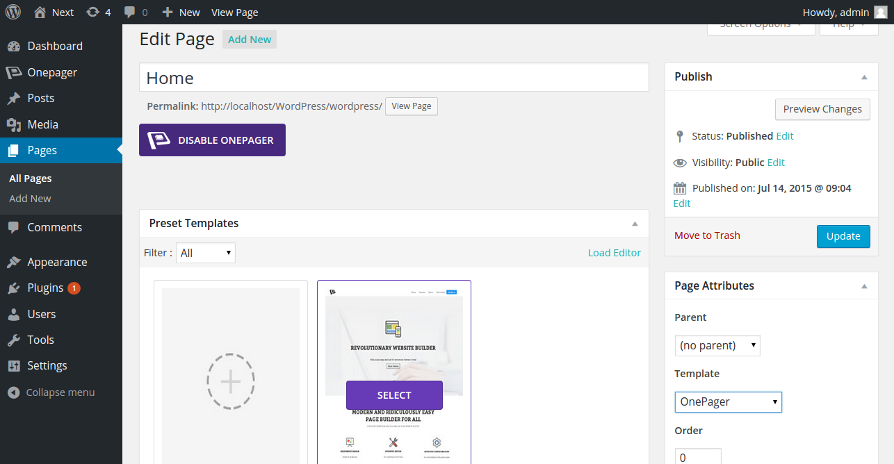

Curious to get started with OnePager, right? That’s great! Here you go. 

This page is the solid ground of some quick tips to have you hit the ground running with powerful OnePager. OnePager is the simplistic plugin implemented with well-researched UX, that allow you to get started within a couple of clicks. 

[plugin:youtube](https://www.youtube.com/watch?v=pwKcmckBZD4) 

Now you are step away to have the taste OnePager awesomeness. If you missed installation part, click on the quick access button below.

<a href="http://getonepager.com/" class="button"><i class="fa fa-fw fa-download"></i> Install OnePager</a>

We bet you enjoy OnePager each pixel as much as we have enjoyed crafting it.

###Accessing the OnePager Backend
When you’ve successfully installed and activated the first cross platform page builder, Onepager, now its time to peed in the onepager backend configuration.
As you know we implemented well-research UX, in this part it takes three steps to configure the mighty Onepager plugin. Here are the steps to follow.

####Create a page for One page theme
To see Onepager in action, the very first step you have to take is to **create a blank page** for your one page website from the following link **Dashboard > Pages > Add New**. Demonstration purpose, I have create an empty page called **Home**. If you have already a blank page created for in your WordPress backend, you are lucky. You are a step ahead of me.

####Change Front Page Displays Setting
To change the front page display setting, head over to **Dashboard > Settings > Reading**. By default WordPress displays the latest post in the homepage, If you want to display any specify post or page in the front page, you have to change your **Front page display setting** from Your latest posts to **A static page**. 

And finally select the intended page from Front page dropdown.  You can see in the image below, I have selected **Home**. When you’ve changed the front page display setting, click **Save Changes**.

####Enable OnePager template
To enable Onepager, open your newly created black page, in my turn it’s **Home**, you can see in the image below. Select **onepager** template from **Template** dropdown in left sidebar, that we’ve bottled with onepager builder plugin. Finally click Update button.   

###Accessing the OnePager Frontend
OnePager is a frontend builder, so frontend is your playing ground. Here you can see all the block, that make you onepager in a couple of clicks. Onepager frontend administrator has all necessary tools and option handles are available, that allow you to flip through to configure Onepager, that lead you walk-through full-fledge one page website. 

Here is my breakdown, just click on [this link](../../blocks/blocks).

