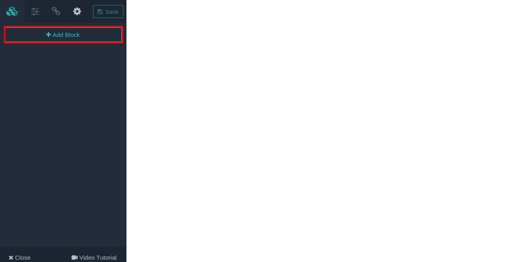
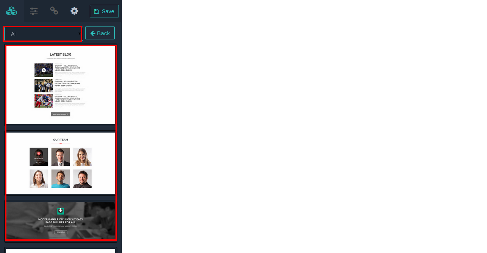
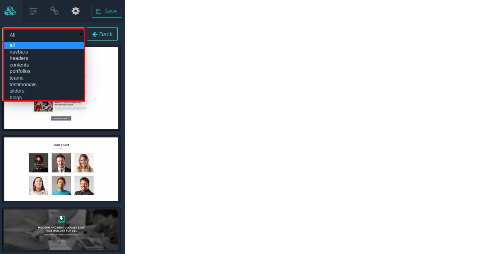
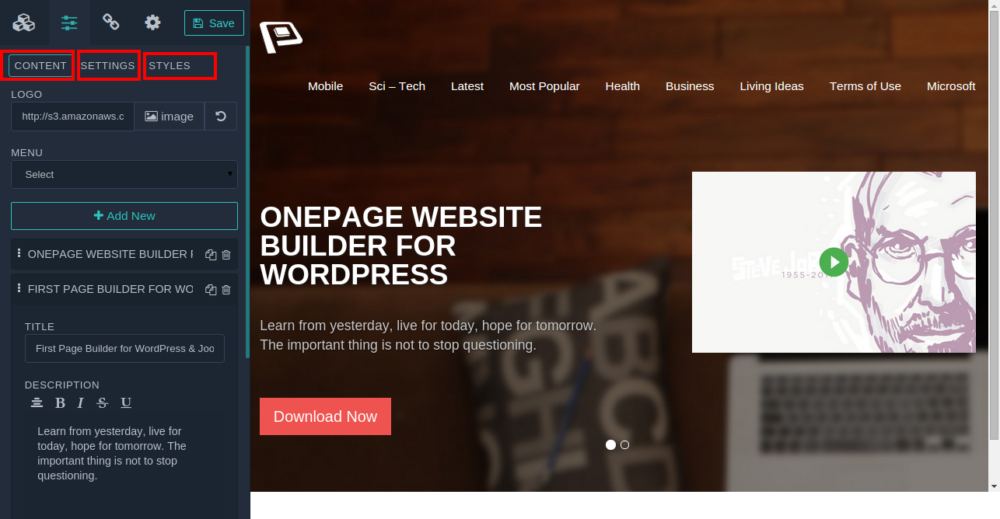
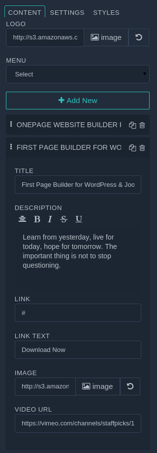
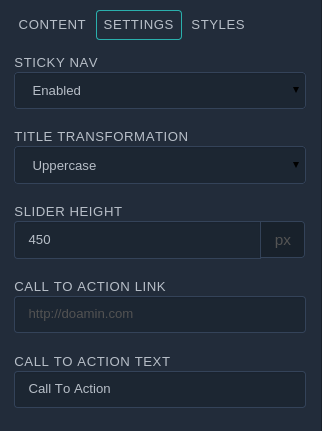
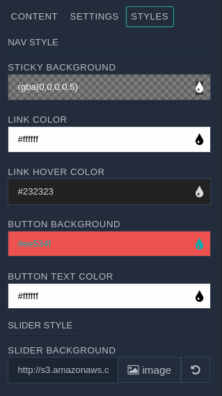

Want to be away from the treadmill of writing same code again and again? Try **OnePager**. We have crafted OnePager with pre-designed block based architecture, that give you power to create unlimited amount of design block without wiring a single line of code, even the prior experience of design fuss. We’ve created unlimited block ready for you with innumerable variation, that allow to make a webstie without touching your keyboard.  

OnePager comes with innumerous variation of Blocks, including Header, Footer, Team, Pricing Table. Now walk-through the quick breakdown of what they are, how they look, and how they are enabled for your OnePager-powered theme.

###Flip Back to Frontend
When you've done OnePager installation, you have to flip back to the Frontend, Now you’ll see the following screenshot. 

Just after your click on **Add Block** button, you can notice, entire Blocks are being listed vertically in the left OnePager administrative sidebar. 

You can notice from the above image the Blocks are coming from **All** category. You can filter them by Header, Footer, Team, Pricing, Content and so on. Have a look.

In this turn, click on the any of the block you want. After clicking the following setting and review will appear like this. 

In the above image you have seen, there tab are marked with red line. They are Content, Settings, and Style

###Content 
Content section contains all the content, that you need added in preset block. Suppose you are adjusting header preset block, the block content are consit of naviagation, image, button, video and more. 

When you select a block you need adjust them at your own need.Have a look in the image below, which handle comes with cotnent tab for the block we selected in the previous screenshot.

###Settings 
Settings section comes with something like global setting of the section, such as you have slider in your section, you may need to adjust it’s height, swich transformation of any section and so on.

 

###Style 
Style section are incorporated with all style handle, that your many require or may need to change for your own. With this section you can change any styling of the selected section.

