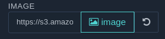
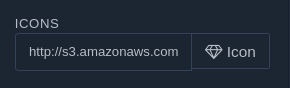
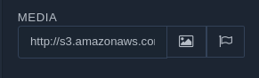
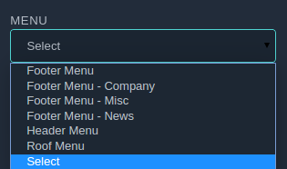
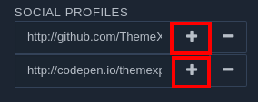
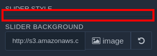
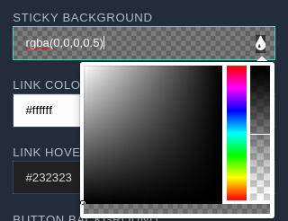
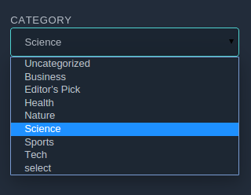
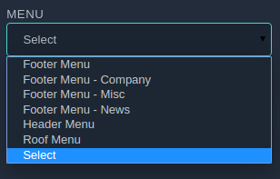
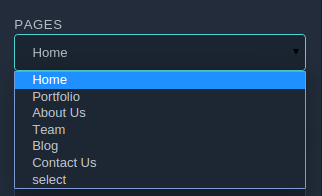

Fields are great way to enable option handles in an application. Like others, **OnePager** accepts vast array essential field, that you need to make a website loveable. Here are those, have  your eyes on them.

###Text 
A text field is a basic text control, accept small of text in any form of user input. When a user indicated that text entry is completed, the text field fires and subsequent event, else pops up with error. 

<p style="text-align:center">Preview</p>

####Arguments
| Name   | Type | Default  | Description |
| ------ | -----| -------- |-------------|           
| type   | string | text | This Value identifies the field type|
| name   | string |  | A unique name required to define |
| label  | string |  | Displays as field label|
| placeholder     | string |  | Text to display in the input when no value is present|
| prepend| string |  | Add content prefix in the text feild|
| append | string |  | Add content suffix in the text feild |
| value  | string |  | String that appears in the text input|

###Exmple Code

```

array(
      'name'=>'title', // Required
      'type' => 'text', 
      'label' => 'Title', // Optional, name will use instead
      'placeholder' => 'Your title here', // Optional, name will use instead
      'prepend' => 'Text', // Optional
      'append' => 'Text', // Optional
      'value' => 'Let's make a better website together' // Default value
    ),

```

###Textarea
If you want, your visitors should enter more than single line input, then use Textarea Text fields are used for single-line input whereas but Textarea takes both single and multi line input. 

<p style="text-align:center">Preview</p>

####Arguments
| Name   | Type | Default  | Description |
| ------ | -----| -------- |-------------|           
| type   | string | textarea | This Value identifies the field type|
| name   | string |  | A unique name required to define |
| label  | string |  | Displays as field label|
| placeholder     | string |  | Text to display in the input when no value is present|
| value  | string |  | String that appears in the textarea input|

####Example Code
```


array(
      'name'=>'title', // Required
      'type' => '‘textarea’', 
      'label' => 'Title', // Optional, name will use instead
      'placeholder' => 'Your title here', // Optional, name will use instead
      'value' => 'Let's make a better website together' // Default value
    ),

```

###Editor
Use text editor field to accept formatted input from user input instead of distorted text box. Editor field in OnePager enables you WYSIWYG editing  capability and interface.

<p style="text-align:center">Preview</p>


####Arguments
| Name   | Type | Default  | Description |
| ------ | -----| -------- |-------------|           
| type   | string | editor | This Value identifies the field type|
| name   | string |  | A unique name required to define |
| label  | string |  | Displays as field label|
| value  | string |  | String that appears in the text editor|

####Example Code
```


array(
      'name'=>'title', // Required
      'type' => 'editor', 
      'label' => 'Title', // Optional, name will use instead
      'value' => 'Let's make a better website together' // Default value
    ),

```

###Image
The field offers the ability to select image from WordPress media manager with WordPress populated settings. 

<p style="text-align:center">Preview</p>

####Arguments

| Name   | Type | Default  | Description |
| ------ | -----| -------- |-------------|           
| type   | string | image | This Value identifies the field type|
| name   | string |  | A unique name required to define |
| label  | string |  | Displays as field label|
| value  | string |  | String that appears as Image input|

####Example Code

```
array(
      'name'=>'title', // Required
      'type' => ''image'', 
      'label' => 'Title', // Optional, name will use instead
      'value' => 'Let's make a better website together' // Default value
    ),

```

###Icon
We have developed an Opensource icon picker to lessen the effort of developers. In OnePager Icon field type enable the picker, that allow you to select fontawesome icons with essential size variation.  

<p style="text-align:center">Preview</p>

####Arguments

| Name   | Type | Default  | Description |
| ------ | -----| -------- |-------------|           
| type   | string | icon | This Value identifies the field type|
| name   | string |  | A unique name required to define |
| label  | string |  | Displays as field label|
| value  | string |  | String that appears as Icon input|

####Example Code

```
array(
      'name'=>'title', // Required
      'type' => 'icon', 
      'label' => 'Title', // Optional, name will use instead
      'value' => 'Let's make a better website together' // Default value
    ),

```

###Media
Media field simultaneously allows you to pick font and images with separate button. Icon button will open the icon pick, and image will open your WordPress media to select image with default WordPress settings.    

<p style="text-align:center">Preview</p>

####Arguments

| Name   | Type | Default  | Description |
| ------ | -----| -------- |-------------|           
| type   | string | icon | This Value identifies the field type|
| name   | string |  | A unique name required to define |
| label  | string |  | Displays as field label|
| value  | string |  | String that appears as Icon and image input|

####Example Code

```
array(
      'name'=>'title', // Required
      'type' => 'icon', 
      'label' => 'Title', // Optional, name will use instead
      'value' => 'Let's make a better website together' // Default value
    ),


```

###Select
The select field allows to display numerous setting option in drop-down, so that developers can easily select their desire option quickly.

<p style="text-align:center">Preview</p>


####Arguments

| Name   | Type | Default  | Description |
| ------ | -----| -------- |-------------|           
| type   | string | select | This Value identifies the field type|
| name   | string |  | A unique name required to define |
| label  | string |  | Displays as field label|
| value  | string |  | String that appears as default selected input|
| Option | array  |  | All set of option should be serialized here|

####Example Code

```
array(
      'name'=>'title', // Required
      'type' => 'select', 
      'label' => 'Title', // Optional, name will use instead
      'value' => 'Value from option' // Default value
       'options'  => array(
        '0'           => 'None',
        'fadeIn'      => 'Fade',
        'fadeInLeft'  => 'Slide Left',
        'fadeInRight' => 'Slide Right',
        'fadeInUp'    => 'Slide Up',
        'fadeInDown'  => 'Slide Down',
      )
    ),


```

###Switch
In OnePager, we have programmed innumerous options, some of the options runs with boolean value. To deal with the boolean option, we enabled Switch field, so that you can easily switch between true and false based option easily. 

<p style="text-align:center">Preview</p>

####Arguments

| Name   | Type    | Default   | Description |
| ------ | -----   | --------  |-------------|           
| type   | string  | switch    | This Value identifies the field type|
| name   | string  |           | A unique name required to define |
| label  | string  |           | Displays as field label|
| value  | boolean |           | boolean that appears as default True or False|


####Example Code

```
array(
      'name'=>'title', // Required
      'type' => 'switch', 
      'label' => 'Title', // Optional, name will use instead
      'value' => 'true or false' // Default value
    ),


```


###Repeater
Repeater is the another time saver in OnePager. It gives you power to repeat group content and single content simultaneously. 

<p style="text-align:center">Preview</p>

####Group Repeater
Group repeater repeats the group content


####Arguments

| Name   | Type      | Default   | Description |
| ------ | -----     | --------  |-------------|           
| type   | string    | repeater  | This Value identifies the field type|
| name   | string    |           | A unique name required to define |
| label  | string    |           | Displays as field label|
| field  | array     |           | fields should be listed in array|


####Example Code

```
array(
      'name'=>'title', // Required
      'type' => 'repeater', 
      'label' => 'Title', // Optional, name will use instead
      'fields' => array(
                  array(array()),
                  array(array())
                  )
    ),

```


####Single Repeater
Single repeater repeats the single specific content.

<p style="text-align:center">Preview</p>

####Arguments

| Name   | Type      | Default   | Description |
| ------ | -----     | --------  |-------------|           
| type   | string  | repeater  | This Value identifies the field type|
| name   | string    |           | A unique name required to define |
| label  | string    |           | Displays as field label|
| value  | array     |           | fields should be listed in array|


####Example Code

```
array(
      'name'=>'title', // Required
      'type' => 'repeater', 
      'label' => 'Title', // Optional, name will use instead
      'value' => array()
    ),

```

##Divider
In OnePager comes with innumerous setting. To make every setting separate from subsequent another, use divider field.

<p style="text-align:center">Preview</p>

####Arguments

| Name   | Type      | Default   | Description |
| ------ | -----     | --------  |-------------|           
| type   | string    | divider   | This Value identifies the field type|
| label  | string    |           | Displays as field label|


####Example Code

```
array(

      'type' => 'divider', 
      'label' => 'Title' // Optional, name will use instead

    ),

```

####Color Picker

Colorpicker in OnePager is a new way to take control over the color on OnePager-enabled theme. 

<p style="text-align:center">Preview</p>

####Arguments

| Name   | Type       | Default   | Description |
| ------ | -----      | --------  |-------------|           
| type   | string     | repeater  | This Value identifies the field type|
| name   | string     |           | A unique name required to define |
| label  | string     |           | Displays as field label|
| value  | string     |           | The value should define in HEX value, RGBE value and so on |


####Example Code

```
array(
      'name'=>'title', // Required
      'type' => 'colorpicker', 
      'label' => 'Title', // Optional, name will use instead
      'value' => array()
    ),

```

##WordPress Specific
OnePager basically makes you one page website in WordPress. When you are dealing with WordPress, you must need to deal with WordPress Pages, Menus and Category. So, In OnePager we’ve bottled them in fields, have a look on them.

###Category
Category field gives you access to comprehend WordPress categories in OnePager, so that you can show category specify post easily.
<p style="text-align:center">Preview</p>

####Arguments

| Name   | Type       | Default   | Description |
| ------ | -----      | --------  |-------------|           
| type   | string     | category  | This Value identifies the field type|
| name   | string     |           | A unique name required to define |
| label  | string     |           | Displays as field label|
| value  | string     |           | The value should define in default category name |


####Example Code

```
array(
      'name'=>'title', // Required
      'type' => 'category', 
      'label' => 'Title', // Optional, name will use instead
      'value' => 'categroy name'
    ),

```

###Menu
Menu field is essential tool in OnePager, It bring you all created Menus like primary menu, footer menu and so on. 
<p style="text-align:center">Preview</p>

####Arguments

| Name   | Type       | Default   | Description |
| ------ | -----      | --------  |-------------|           
| type   | string     | menu      | This Value identifies the field type|
| name   | string     |           | A unique name required to define |
| label  | string     |           | Displays as field label|
| value  | string     |           | Page name should in menu name |


####Example Code

```
array(
      'name'=>'title', // Required
      'type' => 'menu', 
      'label' => 'Title', // Optional, name will use instead
      'value' => 'Default menu name'
    ),

```

###Page
Sometime you need show page in sidebar or somewhere else in you website, In one page you will have the facility, you can incorporate all WordPress page.
<p style="text-align:center">Preview</p>

####Arguments

| Name   | Type       | Default   | Description |
| ------ | -----      | --------  |-------------|           
| type   | string     | page      | This Value identifies the field type|
| name   | string     |           | A unique name required to define |
| label  | string     |           | Displays as field label|
| value  | string     |           | The value should define in WordPress page name   |


####Example Code

```
array(
      'name'=>'title', // Required
      'type' => 'page', 
      'label' => 'Title', // Optional, name will use instead
      'value' => 'default page you can define'
    ),

```
