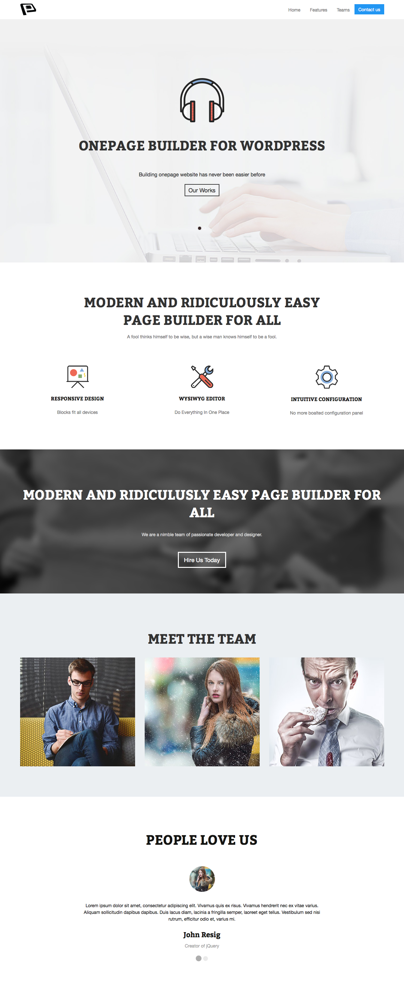
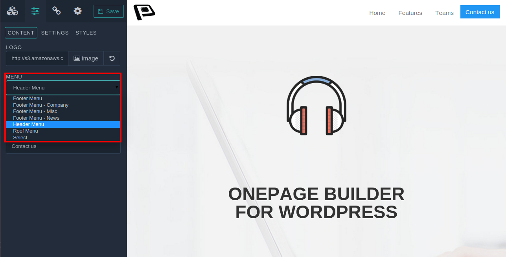
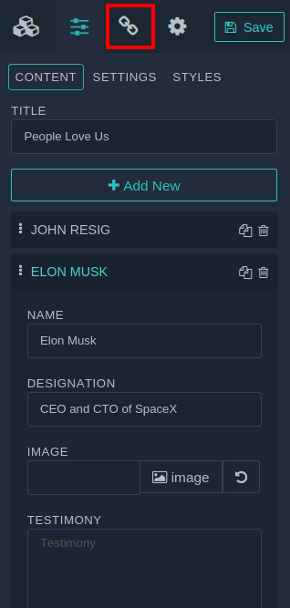

One page websites are incorporated with many of individual blocks. Each block servers a unique purpose. To navigate the users instantly in the prioritise one, menu items are directly linked to directly those blocks. In OnePager, It’s simple. Let’s dig in.

###Step 01
After [installing Onepager](../../basics/getting-started), head over to the frontend, turn on Enable Build Mode ,   add a couple of blocks as one page looks. For quick demonstration, four blocks have been added  serializing **Menu**, **Slider**, **Service**, **Team** and **Testimonial**. Have your eyes on the frontend screenshot. 

  
###Step 02

You may have many of menu set created in your WordPress backend. If you don’t know which menu has been added as in your navbar block, simply click on navbar block, it will open a setting in the right sidebar, make sure you have exact menu selected. If you want to change your menu default select, you can update menu section.  In my turn, **Header Menu** is selected.

###Step 03
Currently a couple of blocks has  been added, but none of the block is linked with Header menu. Now I’ll link **Testimonial Block**, to **Header menu** adding a menu item titled **Testimonial**. To link Testimonial block to menu, click on Testimonial block, It open up all associated settings in the right sidebar, and click on **Link** icon. Look on the following.

###Step 04
Now fill **Menu Name** field with your menu item name, that will be added in you menu as item. You can change **Menu ID** with your desired unique menu id name, but you can keep it unchanged, and click **Add to Menu**. 

Make sure, you have selected the exact **Menu Position** selected, that you’ve already selected  in Step 02, otherwise the change will not visible until Menu Position and Menu selection match. 

Step 05

Onepager is featured with **WYSIWYG interface**, you can see the change live. When you clicked **save** button. Testimonial button has added in menu. When you click on the Testimonial link, it will walk-through the testimonial block with cool transition.  Now flip through the beneath screenshot. 

**Note:** If you want to link each menu item with each block, create a blank menu from **Dasboard >> Appearance >> Menus**, and select the blank menu when you select navbar. like step 02. Now start linking menu with menu with each block.  